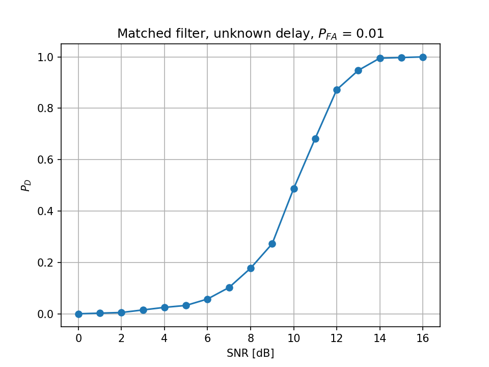

# detection

Detection and parameter estimation of weak targets in radar signals and infrared image sequences.
Core question: how much detection performance is lost the less is known about the target?

## Result



Probability of detection vs. SNR for the matched-filter detector with unknown target delay,
one decision per receive window, false-alarm probability fixed at 0.01.

## Status

### Radar signals
- [x] Signal model: unit-energy linear chirp, single-pulse receive window with complex white Gaussian noise
- [x] Matched filter / pulse compression
- [ ] CFAR detection
- [ ] Kalman tracking of the target delay
- [ ] Direction-of-arrival estimation on a simulated array

### Infrared image sequences
- [ ] Synthetic sequences: small moving target in Gaussian background, known ground truth
- [ ] Background suppression (top-hat filtering)
- [ ] 2D matched filter for small targets, verified on synthetic data
- [ ] Kalman tracking of target position across frames
- [ ] Evaluation on the annotated Anti-UAV410 dataset

### Comparison
- [ ] Detection performance by level of prior signal knowledge, from matched filter to blind detection

## Run

```
pip install numpy matplotlib
python chirp.py       # plots two simulated receive windows
python hit_rate.py    # P_D curve -> figures/pd_curve.png
```
